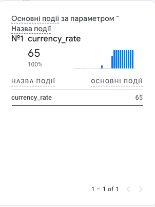
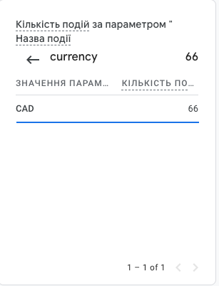
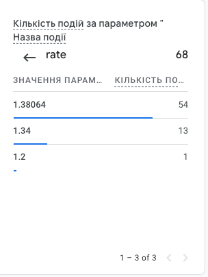

# hsa-gamp
HSA homework 2 - GAMP

## How to start
1. Clone the repo to local machine
2. Head to `./server` on local machine and run `npm install` (required once to create node_modules folder before it will be projected to inner docker container filesystem)
3. Head to root of the cloned repo
4. Create actual `.env` file from `.env.dist` in the `./server` folder
5. Provide values:
   1. CURRENCY_CONVERTER_API_KEY (for resource https://api.freecurrencyapi.com)
   2. GAMP_API_SECRET (from GA console)
   3. MEASUREMENT_ID (from GA console)
6. Run `docker-compose up -d`

## Proofs
 
 
 